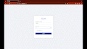

# LMS_Dashboard

LMS Dashboard built with React as frontend and Java Spring Boot as a backend. Backend is still only on loacl server so this can't be used as a product for now but can be viewed how this project is built.

Thank you if you are here <3

  

 

  
  
  
  

 

# Vite ⚡

> Next Generation Frontend Tooling

- 💡 Instant Server Start
- ⚡️ Lightning Fast HMR
- 🛠️ Rich Features
- 📦 Optimized Build
- 🔩 Universal Plugin Interface
- 🔑 Fully Typed APIs

Vite (French word for "quick", pronounced [`/vit/`](https://cdn.jsdelivr.net/gh/vitejs/vite@main/docs/public/vite.mp3), like "veet") is a new breed of frontend build tooling that significantly improves the frontend development experience. It consists of two major parts:

<h1>Local setup to run this project</h1>

<h3>npm i  </h3>

<h3>npm run dev(vite command is different from create-react-app)</h3>

## License

[MIT](LICENSE).
